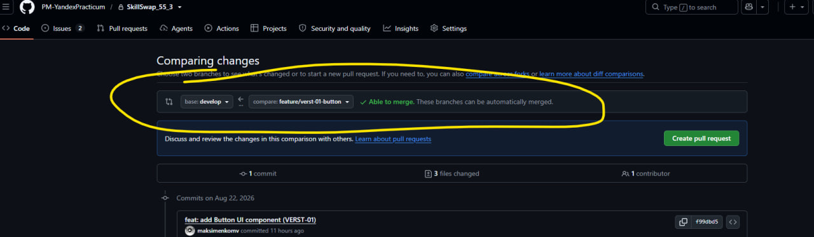

# Инструкция: как делать Pull Request

После того как вы взяли задачу в работу и выполнили её:

1. У себя на компьютере в IDE сделайте коммит и `push` в ту ветку, которую вы создавали для выполнения этой задачи.

2. Перейдите в репозиторий на GitHub. Для вашей ветки появится кнопка **Create pull request** / **Compare & pull request**.

   Перед созданием PR обязательно проверьте:
   - **base** — `develop`;
   - **compare** — ваша ветка с задачей.

   См. картинку.
   

4. Создайте Pull Request и ждите результатов ревью от тимлида или помощника тимлида.

5. После ревью возможны два варианта.

### 4.1. Правок нет

Тимлид мержит Pull Request в ветку `develop`.

**Кнопку `Merge pull request` нажимает только тимлид.**

### 4.2. Есть правки

Внесите необходимые изменения у себя в **той же ветке**, после чего снова сделайте `commit` и `push`.

**Больше ничего в GitHub делать не нужно.**

Новые коммиты автоматически попадут в тот же Pull Request, который был создан изначально.

Не создавайте новый PR и не нажимайте `Merge pull request`.

После `push` просто напишите в командном чате, например:

> Правки сделал, всё запушил.

После этого тимлид или помощник повторно возьмёт PR на ревью.

Если снова потребуются изменения — повторяем пункт 4.2.

---

**Кратко:** Pull Request для задачи создаётся один раз. Все последующие исправления пушатся в ту же ветку и автоматически добавляются в этот PR. Кнопку **Merge pull request** нажимает только тимлид.
